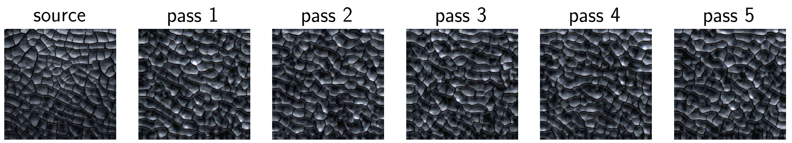
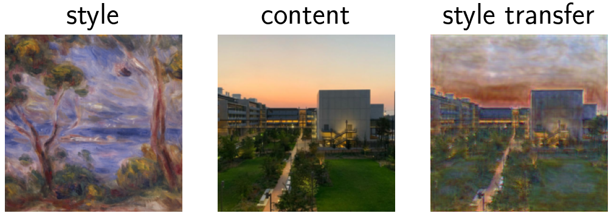

# Optimal textures


An implementation of the texture generation algorithm proposed in [Optimal Textures: Fast and Robust Texture Synthesis and Style Transfer through Optimal Transport](https://arxiv.org/abs/2010.14702).

## Example

#### Texture generation

#### Style transfer


## Usage 

* In order to used pre-trained decoder weights, shomework-1.texet up a directory containing `.pth` weight files with the form
```bash
Relu1_1_decoder_state.pth
Relu2_1_decoder_state.pth
Relu3_1_decoder_state.pth
Relu4_1_decoder_state.pth
Relu5_1_decoder_state.pth
```
If you want to train your decoders on your own image instead, this directory will be used to store the generated weights.

* Set layer-specific parameters like the number of epoch and the learning rate for the decoders training phase, as well as iteration parameters in the dictionary `observed_layers` at the bottom of the file `decoders.py`.

* Run the generation process with

```bash
python run.py path_to_source_image path_to_decoder_states_directory -o output_path -n n_passes -t train
```

* Run the style transfer process with

```bash
python run.py path_to_source_image path_to_decoder_states_directory -c path_to_content_image -s content_strength -o output_path -n n_passes -t train
```


## Requirements
* Python 3
* torch
